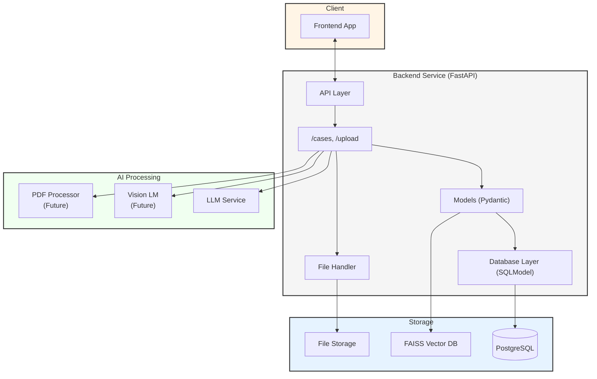

# Healthcare AI

## Proposed Architecture

```mermaid
graph TB
    subgraph Client
        FE[Frontend App]
    end

    subgraph Backend["Backend Service (FastAPI)"]
        API[API Layer]
        Routes["/cases, /upload"]
        Models["Models (Pydantic)"]
        DB_Layer["Database Layer (SQLModel)"]
        FileHandler["File Handler"]
        
        API --> Routes
        Routes --> Models
        Routes --> FileHandler
        Models --> DB_Layer
    end

    subgraph Storage
        DB[(PostgreSQL)]
        Files[File Storage]
        VectorDB[FAISS Vector DB]
    end

    subgraph AI["AI Processing"]
        LLM[LLM Service]
        VLM["Vision LM<br/>(Future)"]
        PDF["PDF Processor<br/>(Future)"]
    end

    FE <--> API
    DB_Layer --> DB
    FileHandler --> Files
    Models --> VectorDB
    Routes --> LLM
    Routes --> VLM
    Routes --> PDF

    style Backend fill:#f5f5f5,stroke:#333,stroke-width:2px
    style Storage fill:#e6f3ff,stroke:#333,stroke-width:2px
    style AI fill:#f0fff0,stroke:#333,stroke-width:2px
    style Client fill:#fff5e6,stroke:#333,stroke-width:2px
```

